# Systify 系統架構導覽（面試簡報用）

這份文件是給「口頭介紹 side project」用的精簡版架構圖集。每一張圖對應一個功能頁面或使用場景，圖下方附上講解重點。圖的內容都對照過目前的程式碼（`src/router.tsx`、`convex/schema.ts`、`convex/http.ts`、`convex/crons.ts`、`convex/chat/*`）。

需要更深的細節時，`docs/` 底下每個主題都有完整的 system design 文件與更多 Mermaid 圖（共 30 多份、60 多張圖），本文件最後有對照表。

---

## 0. 一句話介紹

> Systify 是一個「把 GitHub repo 匯入後，用 AI 幫你理解架構」的工具。前端是 React SPA 部署在 Vercel，後端全部跑在 Convex（DB + serverless functions + scheduler + HTTP endpoint 一體），外部整合 WorkOS 登入、GitHub App、Daytona sandbox 與 OpenAI / Anthropic 兩家 LLM。

---

## 1. 全局系統架構（Runtime Boundaries）

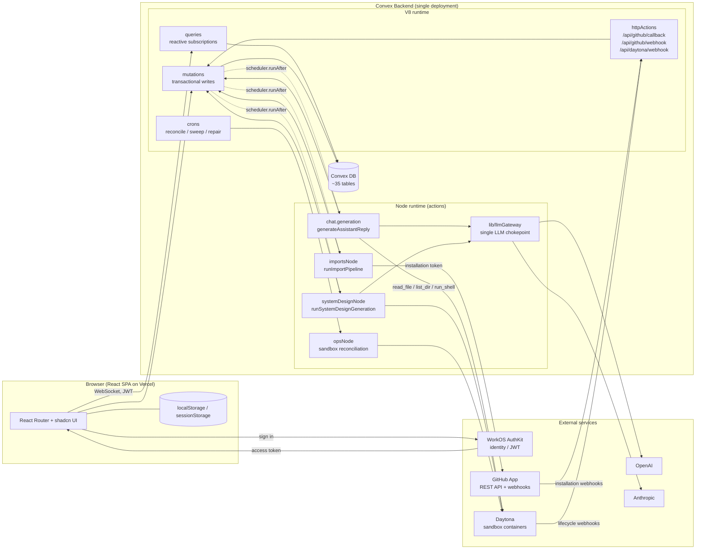

**講解重點**

- 沒有自己的 API server。Convex 同時是資料庫、後端、背景排程器與少量 HTTP 整合端點。
- 前端透過 WebSocket 訂閱 query，資料變動即時推送。串流回覆也是靠這個機制，不用另外做 SSE。
- 長時間、需要 Node SDK 的工作（GitHub App、Daytona、LLM）放在 Node runtime 的 action，由 mutation 透過 scheduler 觸發。
- 所有 LLM 呼叫都經過 `llmGateway`。OpenAI 與 Anthropic 是對等的 provider，可在同一個介面下切換。

---

## 2. 頁面與路由地圖

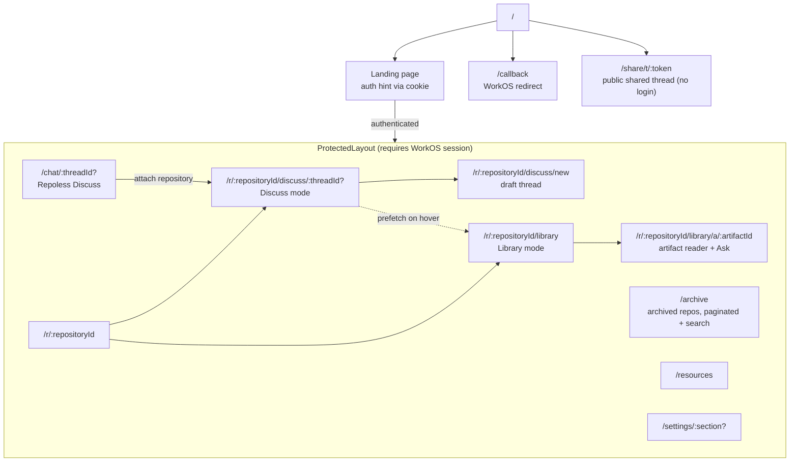

**講解重點**

- 兩個核心模式：**Discuss**（自由對話，可逐則訊息開啟 Library / Sandbox grounding）與 **Library**（讀 artifact 文件 + 針對文件 Ask）。
- 使用者可以先在 `/chat` 不綁 repo 聊天，之後再「attach repository」把 thread 升級，歷史訊息不會被改寫。
- 所有頁面 lazy load。切到 Library 時在 hover 就先 prefetch route chunk，減少切換等待。
- `/share/t/:token` 是唯一公開頁面，用 `threadShares` 表發 token 讓外部人閱讀對話。

---

## 3. 場景：登入與連接 GitHub App

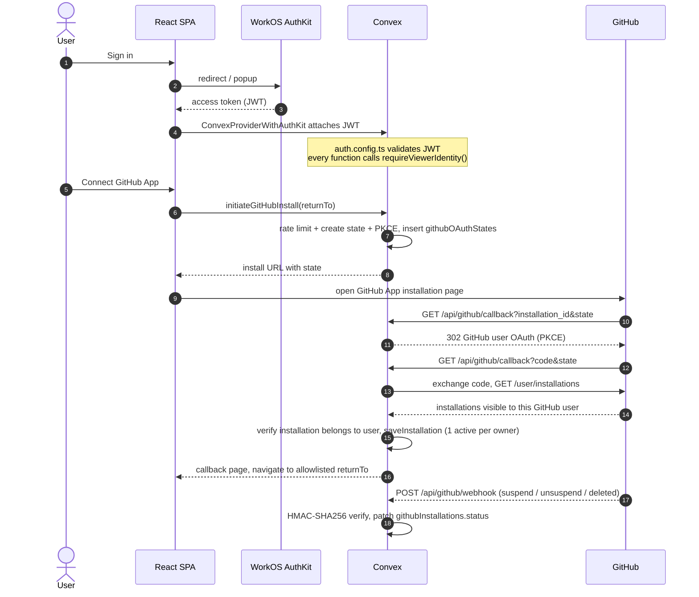

**講解重點**

- 不用 personal access token，用 GitHub App installation token，權限由使用者在 GitHub 端控制。
- Callback 帶回來的 `installation_id` 是不可信輸入。多做一次 GitHub user OAuth，確認「這個 GitHub 使用者真的能存取這個 installation」，才綁定到 Systify 帳號。
- `returnTo` 走 origin allowlist，避免 open redirect。
- Webhook 用 HMAC 常數時間比對，維護 installation 狀態機（active / suspended / deleted）。

---

## 4. 場景：匯入 Repository（sandbox-free）

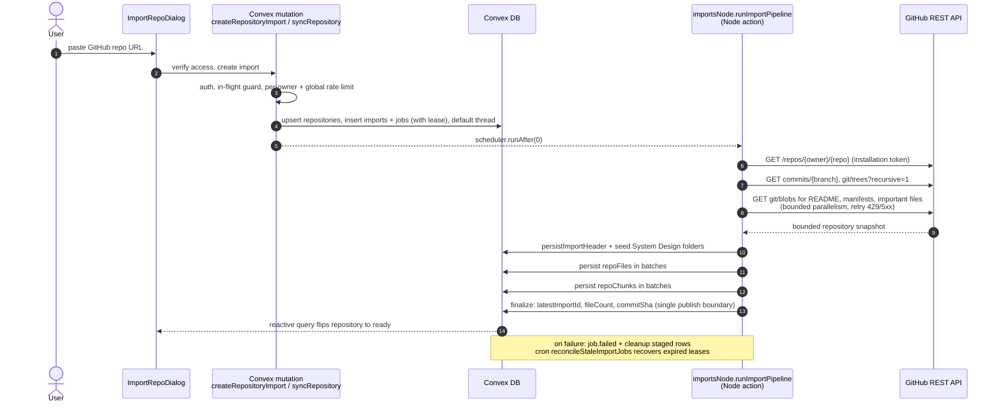

**講解重點**

- 匯入完全不開 sandbox，只打 GitHub API，成本低、速度快。Sandbox 只在真的需要即時檔案系統時才 lazy provision。
- 寫入分批（Convex 單次 transaction 有大小限制），最後由一個 finalize mutation 一次發布，中途失敗不會留下半成品被看到。
- Job 帶 lease，action 掛掉時由 cron 回收，不會卡在 running。
- Sync 走同一條 pipeline。前端在 tab 重新 focus 時會打 `checkForUpdates` 比對 remote SHA，顯示「有新 commit」。

---

## 5. 場景：Discuss 送出訊息與串流回覆

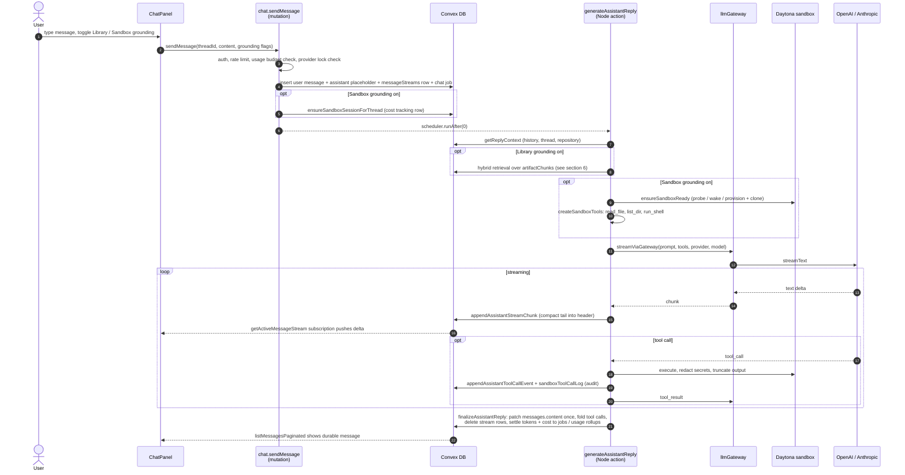

**講解重點**

- **熱資料與冷資料分表**：串流中的內容放 `messageStreams` / `messageStreamChunks`，完成後才一次寫進 `messages`，再刪掉熱資料。歷史訊息的 query 不會因為串流一直 invalidate。
- **每則訊息獨立的 grounding toggle**：Library = 對 artifact 做 RAG；Sandbox = 給 LLM 三個受限工具，在 Daytona 裡讀真實原始碼。
- **Sandbox 安全四層**：system prompt、Zod schema、tool layer（deny list、路徑解析、timeout、輸出上限、secret redaction）、Daytona 容器本身。
- **Thread provider lock**：一個 thread 一旦由某家 provider 回過話，就鎖定該 provider，避免上下文風格跳動。
- 每次回覆結算 token 與費用，寫入 `jobs` 與 `userUsage*` rollup 表，供每日 / 週期用量預算判斷。

---

## 6. 場景：Library 模式（Artifact 索引與 Ask 檢索）

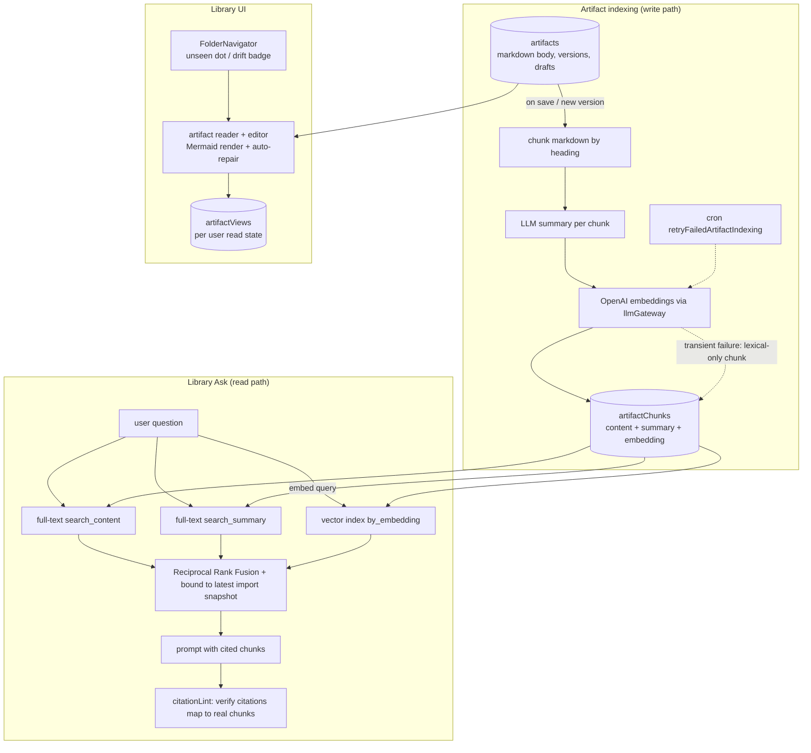

**講解重點**

- Library 是「以文件為中心」的模式。Artifact 是 Design Docs 產生或使用者自己寫的 markdown。
- 檢索是 **hybrid**：兩組 full-text index（內文、摘要）加 vector index，用 RRF 合併排序。Embedding 失敗時該 chunk 降級成只走 lexical，不阻塞索引。
- 回答後有 citation lint，確認引用的 chunk 真的存在，減少幻覺引用。
- Artifact 上帶 `alignedImportCommitSha`，跟 repo 最新 import 比對就能標示「這份文件可能過期」。

---

## 7. 場景：Design Docs 產生（System Design generation）

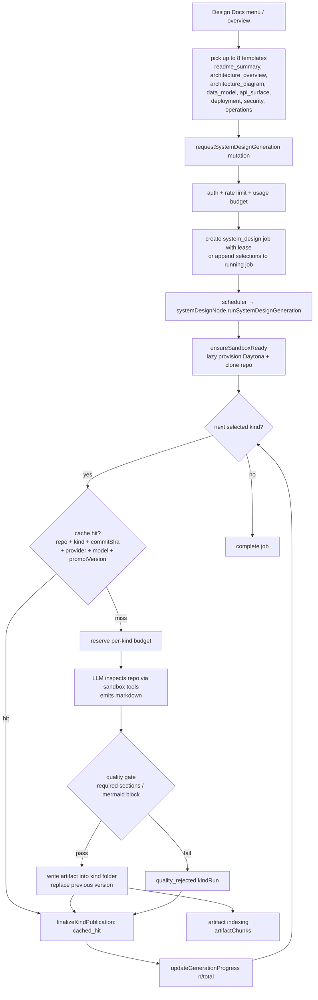

**講解重點**

- 每個模板是一個 **kind**，逐一執行，進度即時推到 UI。使用者可以在執行中追加勾選。
- **Idempotent cache key**：同一個 commit、同一個模型、同一版 prompt 不會重算，直接重用舊 artifact，省 LLM 費用。
- 有 quality gate。架構圖模板要求至少有一個 Mermaid block，不合格記成 `quality_rejected` 而不是寫出爛文件。
- 每個 kind 獨立結算成本與 metrics（duration、steps、tokens、cost）。

---

## 8. 場景：Sandbox 生命週期與可靠性

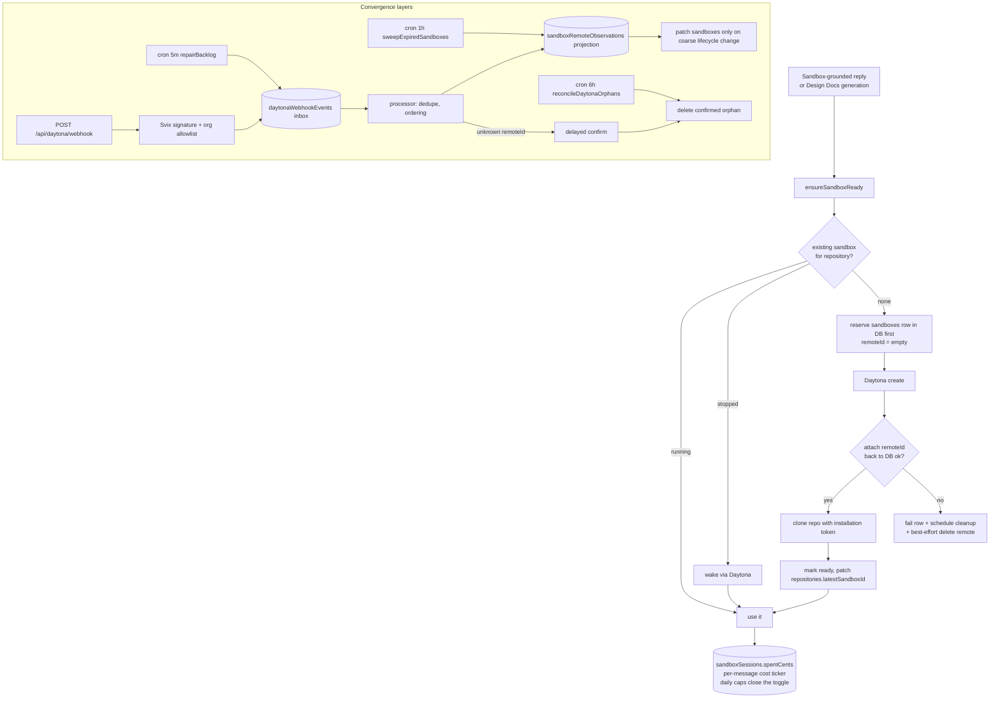

**講解重點**

- **DB-first provisioning**：先在 Convex 佇下 row 再呼叫 Daytona，任何一步失敗都有紀錄可追、可清。孤兒資源是系統設計問題，不是「清掃 bug」。
- **三層收斂**：webhook（快）、cron 對帳（保底）、request path 清理。Webhook 走 inbox + projection，重複與亂序事件都能處理。
- **成本可見**：sandbox session 累計花費、每則訊息顯示估算成本、每人每 repo 每日上限用完會直接關掉 Sandbox toggle。

---

## 9. 核心資料模型（簡化版）

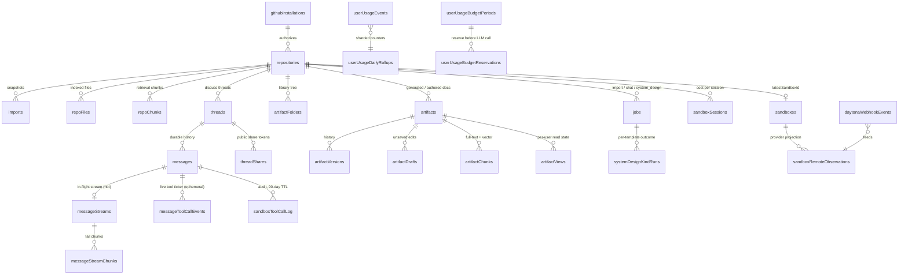

**講解重點**

- 幾乎每張表都有 `ownerTokenIdentifier`，資料隔離在 index 層就做掉，query 一律 `withIndex` 加 owner 條件。
- 刻意把「熱 / 冷」「短暫 / 持久」分開：`messageStreams` vs `messages`、`messageToolCallEvents` vs `sandboxToolCallLog`。
- 用量走 sharded counter rollup，避免高頻寫入同一 document 造成 OCC 衝突。

---

## 10. 橫切關注：請求防護與背景維運

```mermaid
flowchart LR
  subgraph Guard["Every write-path mutation"]
    A[auth: requireViewerIdentity] --> B[ownership check]
    B --> C[in-flight guard<br/>OPERATION_ALREADY_IN_PROGRESS]
    C --> D[per-owner rate limit]
    D --> E[global rate limit]
    E --> F[usage budget reservation]
    F --> G[write rows + schedule action]
  end

  subgraph Gateway["llmGateway"]
    H[fairness buckets<br/>per-user + global] --> I[provider dispatch<br/>OpenAI / Anthropic]
    I --> J[retry on 429 / 5xx]
    J --> K[normalize usage → cost USD]
  end

  subgraph Crons["crons.ts"]
    S1[5m reconcile stale interactive jobs]
    S2[5m reconcile stale import jobs]
    S3[1h sweep expired sandboxes]
    S4[6h reconcile Daytona orphans]
    S5[5m repair Daytona webhook backlog]
    S6[retry failed artifact indexing]
    S7[12h cleanup expired OAuth states]
    S8[cleanup expired sandbox tool-call logs]
    S9[1h repair chat history groups]
  end

  G --> Gateway
  K --> Settle[settle usage to jobs + rollups]
```

**講解重點**

- 防護順序刻意排成「便宜的先擋」：先 auth 與 ownership，再 in-flight，再 rate limit，最後才動 budget。全局限流被擋時不留任何 side effect。
- Job 都有 lease。Action 中途死掉不會永久卡住，cron 每 5 分鐘回收並把 assistant message 標成 failed。
- 維運不是 best effort。Cron 是可靠性設計的一部分，跟 webhook 互為備援。

---

## 11. 部署模型

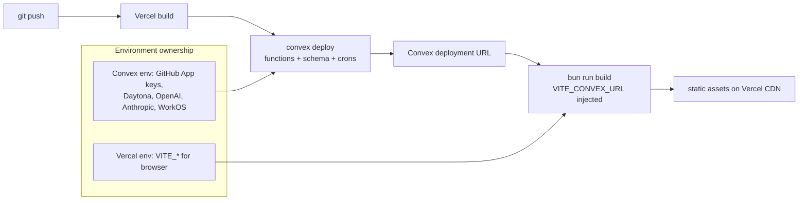

**講解重點**

- 只有一套 CD。Vercel build 裡順便跑 `convex deploy`，preview branch 也會拿到自己的 Convex deployment。
- 秘密全部在 Convex 端，瀏覽器只拿到 `VITE_` 前綴變數。

---

## 附錄：既有文件對照表

想深入哪個主題，直接翻對應文件（都在 `docs/` 底下，內含更細的 Mermaid 圖）：

| 本文件章節 | 深入文件 |
| --- | --- |
| 1 全局架構 | `core/system-overview.md`、`integrations/integrations-and-operations.md` |
| 2 路由 | `chat/service-modes-discuss-library-system-design.md`、`chat/repository-mode-switching-system-design.md`、`client/landing-auth-hint-system-design.md` |
| 3 登入 / GitHub App | `core/auth-and-access.md`、`integrations/github-app-integration-system-design.md`（18 張圖，含完整 sequence 與 state machine）、`integrations/github-callback-returnto-allowlist-system-design.md` |
| 4 匯入 | `repository/repository-lifecycle.md`、`repository/import-persistence-system-design.md`、`repository/repository-remote-freshness-check-system-design.md` |
| 5 Discuss 串流 | `chat/chat-and-analysis-pipeline.md`、`chat/streaming-reply-optimization-system-design.md`、`chat/chat-context-retrieval-system-design.md`、`sandbox/sandbox-mode-system-design.md`、`sandbox/sandbox-mode-security-system-design.md` |
| 6 Library | `chat/artifact-view-state-system-design.md`、`repository/artifact-import-drift-system-design.md`、`chat/instant-view-switching-system-design.md` |
| 7 Design Docs | `architecture/system-design-generation.md`、`architecture/eval-workflow.md` |
| 8 Sandbox | `sandbox/orphan-resource-handling.md`、`sandbox/sandbox-provisioning-cleanup-system-design.md`、`sandbox/daytona-webhook-reconciliation-system-design.md`、`sandbox/sandbox-tool-call-audit-log-system-design.md` |
| 9 資料模型 | `core/domain-and-data-model.md` |
| 10 防護 / 維運 | `architecture/rate-limiting-and-fairness.md`、`architecture/llm-gateway.md`、`architecture/cost-tracking.md` |
| 11 部署 | `integrations/vercel-convex-deployment-system-design.md` |
