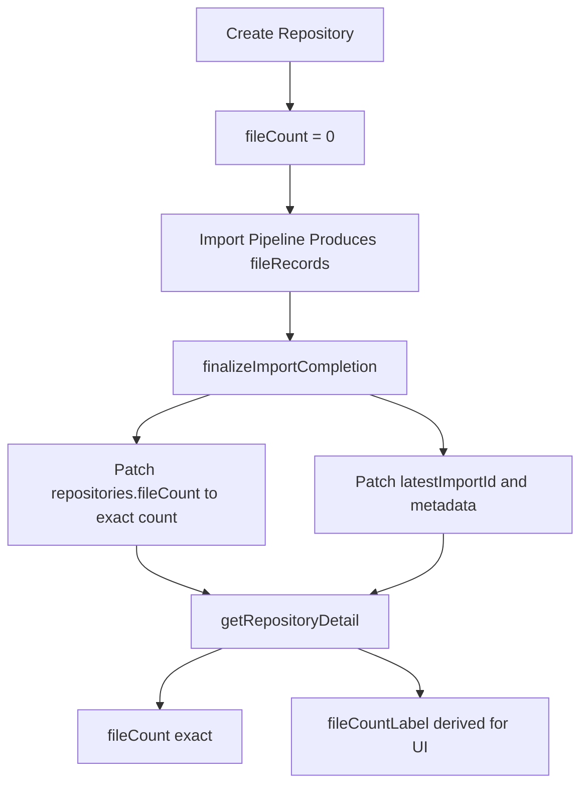

# Plan 06 — `getRepositoryDetail` File Count Denormalization

- **Priority**: P2
- **Scope**: 主畫面 repository detail subscription 的 file count over-fetch 修正。
- **Conflicts**:
  - `convex/schema.ts`：與 Plans 02 / 04 / 07 / 08 衝突。
  - `convex/imports.ts`：與 Plans 03 / 04 衝突。
  - `convex/importsNode.ts`：若要從 finalize 傳入 `fileCount`，會與 Plan 04 實作交疊。
  - `convex/repositories.ts`：與 Plan 02 衝突。
- **Dependencies**: 建議在 Plan 04 後做，因為 `fileCount` 應跟著 finalize publish 一起切換。

## 結論

這個需求仍然建議用**最佳實踐**來做，只是**不需要額外為舊資料設計 migration rollout**。

也就是說：

- 資料模型本身要乾淨
- query / mutation 邊界要清楚
- 顯示邏輯和資料語意要分離
- 但不需要為 legacy repo 加 dual-read、backfill、或暫時相容層

因此這個 plan 採用的方向是：

- **denormalized exact count**
- **finalize-time publish**
- **required schema field**
- **display label derived on read**

前提假設是：部署前先清掉舊 repository，或接受它們不相容而不保留。

詳細設計見 `docs/repository-filecount-rollout-system-design.md`。

## 背景

`convex/repositories.ts` 的 `getRepositoryDetail` 是前端主畫面的 live subscription。現在它為了顯示檔案數，會對最新 import 額外掃最多 401 筆 `repoFiles`：

```ts
const latestImportId = repository.latestImportId;
const sampledFiles = latestImportId
  ? await ctx.db
      .query('repoFiles')
      .withIndex('by_importId', (q) => q.eq('importId', latestImportId))
      .take(FILE_COUNT_DISPLAY_LIMIT + 1)
  : [];
```

這條 query 本身不大，但它掛在高頻 re-run 的 subscription 上。只要 `jobs`、`analysisArtifacts`、`repository` 等資料變動，這段 logic 就可能被重跑，形成不必要的 read amplification。

## 目標

1. 讓新 import 完成後，`repositories.fileCount` 成為主要讀取來源。
2. 保持 publish boundary 清楚，讓 `fileCount` 和目前 snapshot 一致。
3. 讓資料語意清楚：`fileCount` 是精確值，`fileCountLabel` 是 UI 顯示值。
4. 完全移除 `getRepositoryDetail` 的多餘 read。

## 修正版做法

### 1. Schema：直接定成 required 欄位

`convex/schema.ts` 的 `repositories` 新增：

```ts
fileCount: v.number(),
```

因為這次不考慮 migration，所以不需要把它做成 optional。直接定成 required，對程式碼比較乾淨：

- 讀取端不用處理 `undefined`
- 型別更簡單
- 新建 repository 時就能保證欄位存在

`createRepositoryImport` 建立新 repository 時，初始值直接寫 `fileCount: 0`。

### 2. 寫入位置：只在 finalize publish 時更新

`fileCount` 不應該在 `persistRepoFilesBatch` 這種 staged write 階段就更新，而應該跟著 `latestImportId` 一起在 `finalizeImportCompletion` / `applyImportCompletionState` patch 到 `repository`。

建議資料來源：

- 在 `importsNode.runImportPipeline` 產生完 `fileRecords` 後，直接取 `fileRecords.length`
- 再把 `fileCount` 當成 finalize mutation 的參數傳入

這樣有兩個好處：

1. 不需要在 mutation 內重新 count `repoFiles`
2. `fileCount` 會和新的 snapshot pointer 同步切換，不會提早曝光

### 3. 讀取位置：回傳精確值，顯示字串另外派生

`convex/repositories.ts` 的 `getRepositoryDetail` 直接改成：

- `fileCount = repository.fileCount`
- `fileCountLabel = fileCount >= FILE_COUNT_DISPLAY_LIMIT ? '400+' : String(fileCount)`

這樣可以完全拿掉 `repoFiles.by_importId.take(401)` 這條 hot-path read。

這樣的語意也更清楚：

- `fileCount` 是資料層的**精確檔案數**
- `fileCountLabel` 是 UI 層的**顯示文案**

### 4. 不做 migration / backfill

這個 plan 明確不做 migration，也不做 backfill。

原因不是偷懶，而是這次已經明確放棄舊資料相容性。既然如此，就不應再把 production rollout 複雜度帶進新設計。

## 流程圖



## 驗證

- `getRepositoryDetail` 測試：
  - `repository.fileCount` 回傳精確值
  - `fileCountLabel` 對 400 以上維持 `400+`
- import flow 測試：
  - finalize 後 repository 會寫入正確 `fileCount`
  - sync 進行中不會先把新 `fileCount` publish 到舊 snapshot 上
- 手動驗證：
  - Convex dashboard 觀察 active repos 的 `getRepositoryDetail` bytes read / latency
  - 新 import 完成後 UI 顯示不變
  - 新建但尚未完成 import 的 repository 顯示 `0`

## Out of Scope

- 不改 `artifacts` / `jobs` / `threads` 的 take 數量
- 不做 `getImportedRepoSummaries` 的優化
- 不改 UI 端顯示文案
- 不做 migration / backfill / dual-read rollout
- 不在這個 plan 內引入新的 aggregate table 或全域 counter component
